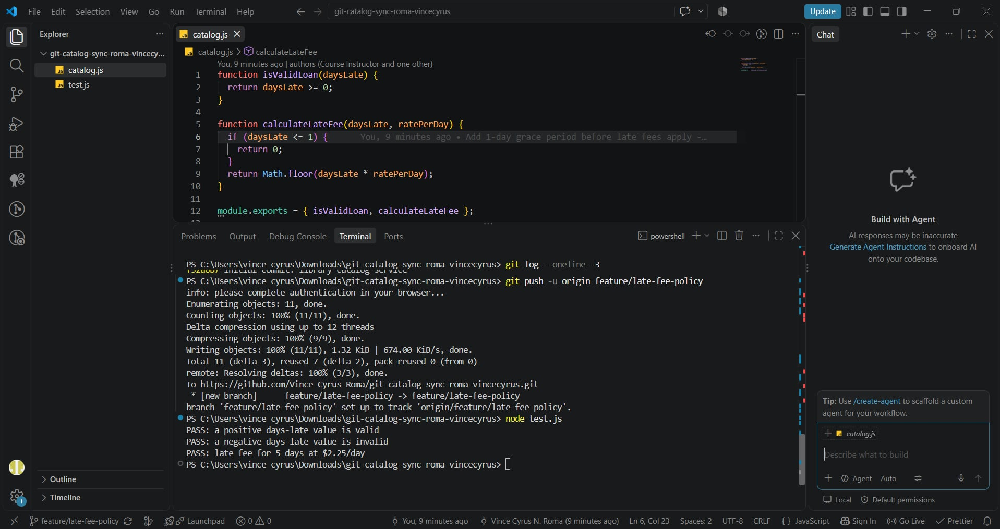
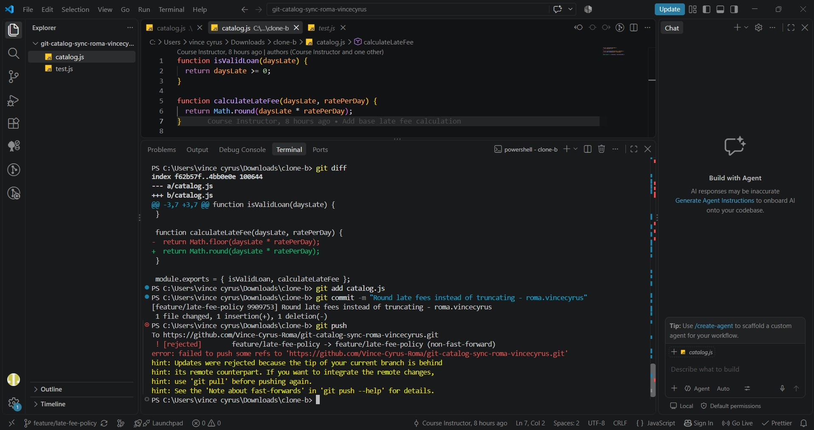
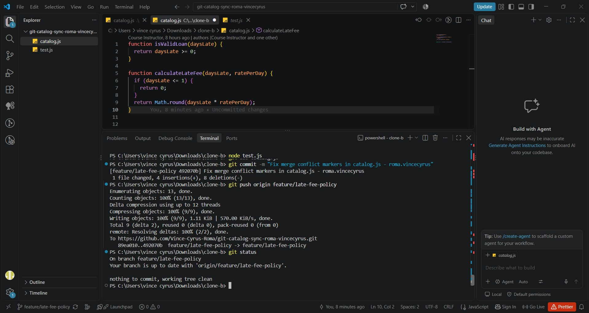
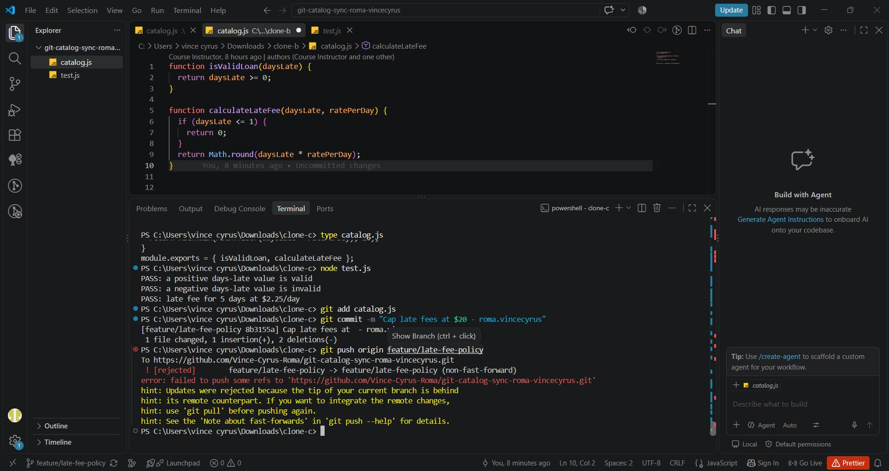
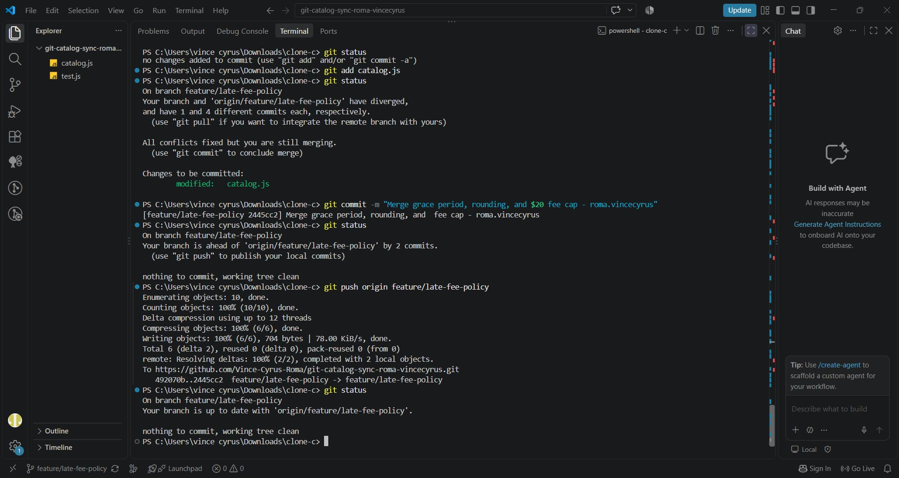
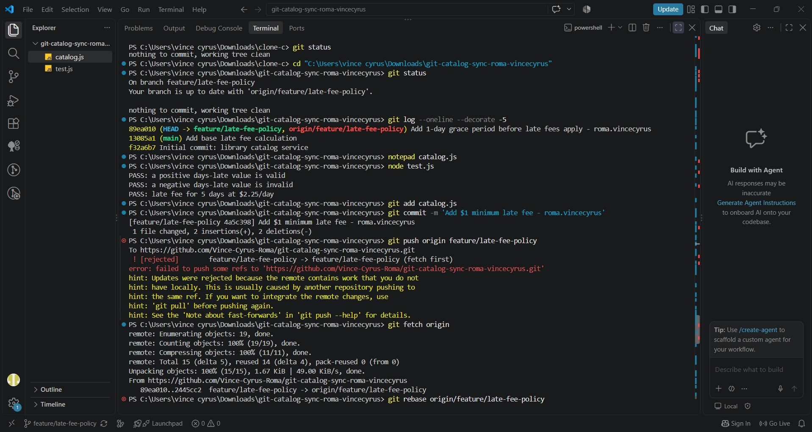
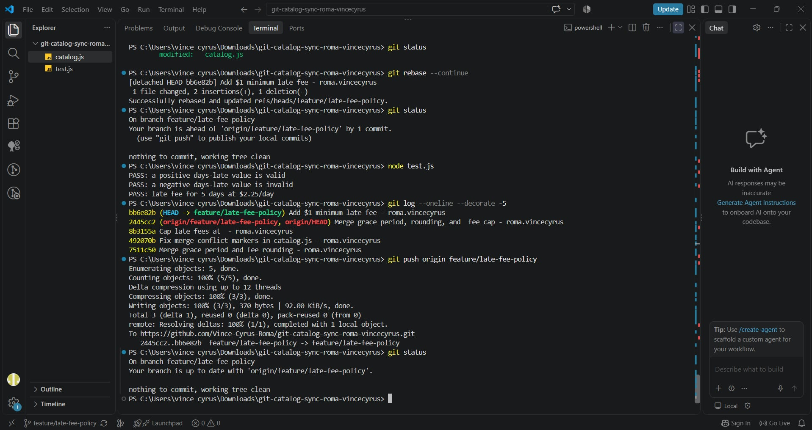

# Git Catalog Sync Workflow

## 1. Final calculateLateFee and contributor changes

The final `calculateLateFee` function is:

function calculateLateFee(daysLate, ratePerDay) {
if (daysLate <= 1) {
return 0;
}

return Math.min(Math.max(Math.round(daysLate \* ratePerDay), 1), 20);
}

The final behavior combines the changes from the different contributors:

- **1-day grace period:** The fee is $0 when `daysLate` is 1 or less. This came from the first contributor's grace-period change.
- **Rounding:** `Math.round()` is used instead of truncating the calculated fee. This came from the second contributor's rounding change.
- **$20 maximum:** `Math.min(..., 20)` prevents the late fee from exceeding $20. This came from the third contributor's fee-cap change.
- **$1 minimum:** `Math.max(..., 1)` ensures that a fee is at least $1 when a late fee applies. This came from the later minimum-fee change.

The grace-period check happens first, so a loan that is 0 or 1 day late still has a fee of $0.

## 2. Task 3 two-way conflict vs. Task 5 three-way conflict

In Task 3, the conflict was between the changes made in Clone B and the changes already pushed from Clone A. Clone B started from an older version of the branch and changed the fee calculation to use rounding, while the remote branch contained the 1-day grace period. Git therefore had to combine two different versions of the same part of `catalog.js`.

In Task 5, the situation involved a more developed history. Clone A had an older local commit adding the $1 minimum fee, while the remote branch already contained the grace period, rounding, and $20 cap changes. The rebase used the common ancestor and replayed the local minimum-fee commit on top of the updated remote history. This made the conflict a three-way merge situation involving the common base, the updated remote history, and the local change being replayed.

## 3. Merge vs. rebase conflict resolution

A merge combines two lines of development and can create a merge commit that records where the histories were joined. In Task 3 and Task 4, merge was used to combine the stale clone's work with the newer remote branch. The conflict was resolved by keeping all required behaviors in the resulting file.

A rebase instead takes the local commit and replays it on top of a newer base. In Task 5, the $1 minimum-fee change was replayed on top of the already-synchronized remote branch. After resolving the conflict, the rebase produced a new commit containing the same intended change on top of the updated history.

The main difference is that merge preserves the divergent history and records the join, while rebase rewrites the local commit so that it appears after the updated base.

## 4. Process change that could have prevented the rejected pushes

A useful process change would be to fetch the remote branch before starting work in each clone.

For example, before making changes, a contributor could run:

git fetch origin
git status

and make sure their local branch is based on the current remote branch.

If everyone regularly synchronized their local branches before starting new work, the contributors would be less likely to make commits from stale branch histories. This would reduce the non-fast-forward push rejections that occurred during the exercise.

## Screenshot Evidence

### Task 1

### Task 2

### Task 3

### Task 4

### Task 5

### Task 6

### Task 7

